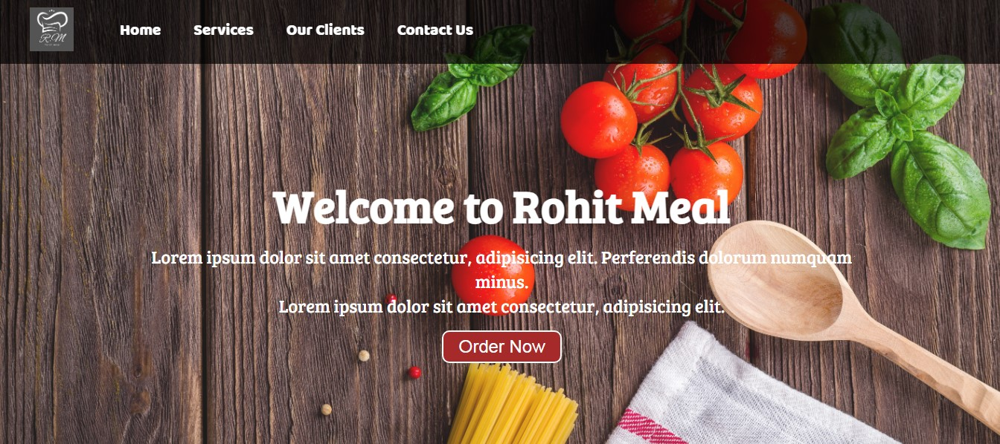

# RohitMeal Website

This is a simple static website for a fictional company called RohitMeal.

## Description

The website is built with HTML and CSS. It includes several sections:

- **Home**: A welcome message and a call-to-action button.
- **Services**: Information about the services provided by RohitMeal, including food catering, bulk ordering, and food ordering.
- **Our Clients**: A showcase of some of the clients of RohitMeal.
- **Contact Us**: A form for visitors to send a message to RohitMeal.

## Setup

To run this project, you just need a web browser. Open the `index.html` file in your web browser.

## Usage

You can navigate through the website using the navigation bar at the top of the page. Click on the links to go to the different sections of the website.

## Contributing

Pull requests are welcome. For major changes, please open an issue first to discuss what you would like to change.
